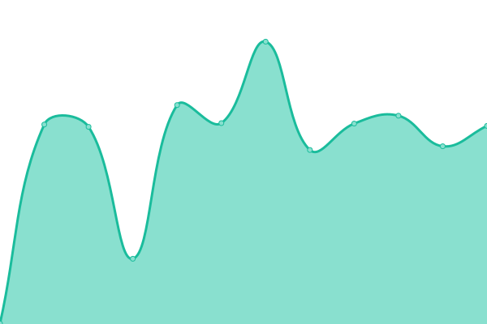
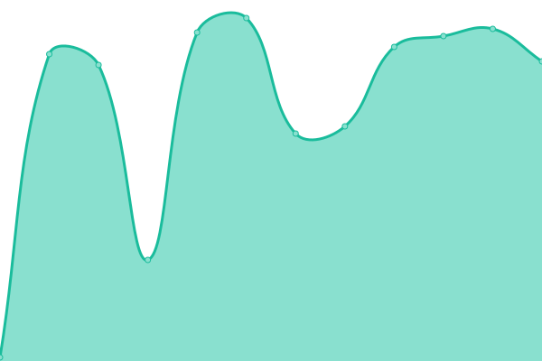
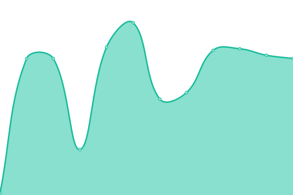

# [📈 Live Status](https://moodysanalytics.github.io/ps-status): <!--live status--> **🟩 All systems operational**

This repository contains the open-source uptime monitor and status page for [moodysanalytics](https://moodysanalytics.github.io/ps-status), powered by [Upptime](https://github.com/upptime/upptime).

With [Upptime](https://upptime.js.org), you can get your own unlimited and free uptime monitor and status page, powered entirely by a GitHub repository. We use [Issues](https://github.com/moodysanalytics/ps-status/issues) as incident reports, [Actions](https://github.com/moodysanalytics/ps-status/actions) as uptime monitors, and [Pages](https://moodysanalytics.github.io/ps-status) for the status page.

<!--start: status pages-->
<!-- This summary is generated by Upptime (https://github.com/upptime/upptime) -->
<!-- Do not edit this manually, your changes will be overwritten -->
<!-- prettier-ignore -->
| URL | Status | History | Response Time | Uptime |
| --- | ------ | ------- | ------------- | ------ |
|  [QA-PS-Analysis](https://qa-api.portfoliostudio.moodysanalytics.net/analysis/v1/ping) | 🟩 Up | [qa-ps-analysis.yml](https://github.com/moodysanalytics/ps-status/commits/HEAD/history/qa-ps-analysis.yml) | 

 414ms
     
 | 

<a href="https://moodysanalytics.github.io/ps-status/history/qa-ps-analysis">100.00%</a>
    

|  [QA-PS-Dremio](https://qa-api.portfoliostudio.moodysanalytics.net/dremio/v1/ping) | 🟩 Up | [qa-ps-dremio.yml](https://github.com/moodysanalytics/ps-status/commits/HEAD/history/qa-ps-dremio.yml) | 

 79ms
     
 | 

<a href="https://moodysanalytics.github.io/ps-status/history/qa-ps-dremio">99.90%</a>
    

|  [QA-PS-Ui-Api](https://qa-api.portfoliostudio.moodysanalytics.net/ui-api/v1/ping) | 🟩 Up | [qa-ps-ui-api.yml](https://github.com/moodysanalytics/ps-status/commits/HEAD/history/qa-ps-ui-api.yml) | 

 77ms
     
 | 

<a href="https://moodysanalytics.github.io/ps-status/history/qa-ps-ui-api">100.00%</a>
    

<!--end: status pages-->

[**Visit our status website →**](https://moodysanalytics.github.io/ps-status)

## 📄 License

- Powered by: [Upptime](https://github.com/upptime/upptime)
- Code: [MIT](./LICENSE) © [moodysanalytics](https://moodysanalytics.github.io/ps-status)
- Data in the `./history` directory: [Open Database License](https://opendatacommons.org/licenses/odbl/1-0/)
